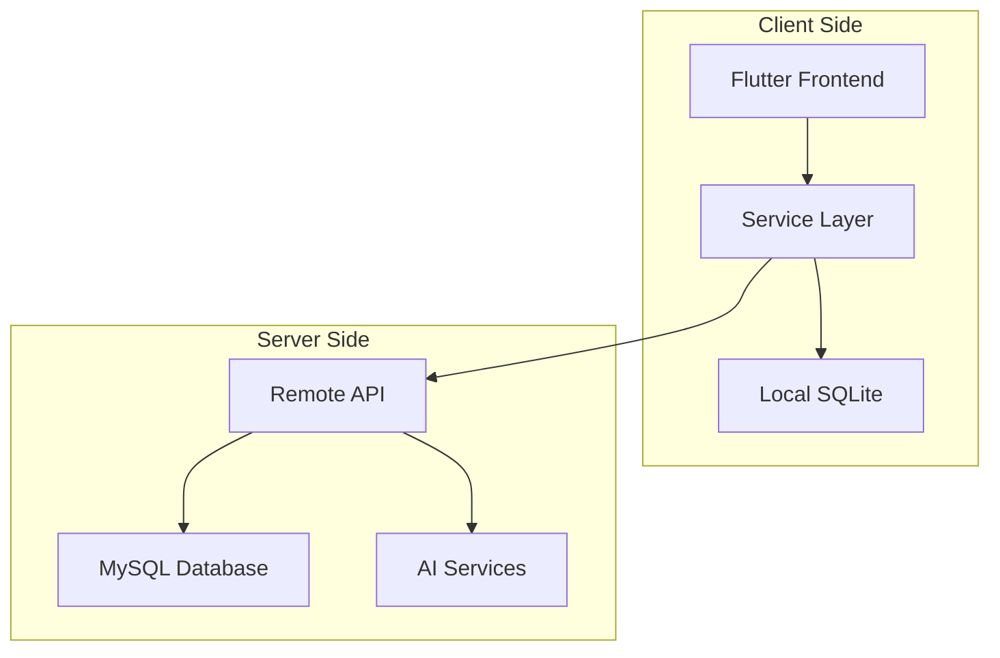

# دستیار هوشمند یک دو سه
## پروژه مدیریت کسب و کار با هوش مصنوعی


---

## 📋 فهرست مطالب

1. [معرفی پروژه](#معرفی-پروژه)
2. [ویژگی‌ها](#ویژگی‌ها)
3. [معماری سیستم](#معماری-سیستم)
4. [نصب و راه‌اندازی](#نصب-و-راه‌اندازی)
5. [ساختار پروژه](#ساختار-پروژه)
6. [مستندات API](#مستندات-api)
7. [راهنمای توسعه](#راهنمای-توسعه)
8. [نسخه‌ها و به‌روزرسانی](#نسخه‌ها-و-به‌روزرسانی)

---

## 🎯 معرفی پروژه

**دستیار هوشمند یک دو سه** یک سیستم جامع مدیریت کسب و کار است که با استفاده از تکنولوژی Flutter و امکانات هوش مصنوعی طراحی شده است. این پروژه شامل دو بخش اصلی می‌باشد:

### 🖥️ **پنل مدیریت (Admin Dashboard)**
- **پلتفرم:** دسکتاپ، وب
- **کاربران:** مدیران و کارکنان
- **ویژگی‌ها:** داشبورد تحلیلی، مدیریت کاربران، گزارش‌گیری

### 📱 **اپلیکیشن مشتری (Customer App)**
- **پلتفرم:** موبایل (Android/iOS)
- **کاربران:** مشتریان نهایی
- **ویژگی‌ها:** خرید آنلاین، چت هوشمند، مشاوره AI

---

## ✨ ویژگی‌ها

### 🤖 **هوش مصنوعی**
- **چت بات هوشمند:** پاسخ‌گویی خودکار به سوالات مشتریان
- **مشاوره خرید:** توصیه محصولات بر اساس نیاز کاربر
- **تحلیل رفتار:** بررسی الگوهای خرید مشتریان

### 📊 **مدیریت کسب و کار**
- **داشبورد تحلیلی:** نمایش آمار فروش و عملکرد
- **مدیریت محصولات:** افزودن، ویرایش و حذف کالاها
- **سیستم CRM:** مدیریت روابط با مشتریان
- **فرم‌ساز:** ایجاد فرم‌های سفارشی

### 🔐 **امنیت و احراز هویت**
- **سیستم کاربری:** مدیریت دسترسی‌ها بر اساس نقش
- **رمزگذاری:** حفاظت از اطلاعات حساس
- **لاگ سیستم:** ثبت تمامی فعالیت‌ها

### 📈 **گزارش‌گیری**
- **آمار فروش:** نمودارهای تحلیلی
- **عملکرد کارکنان:** ارزیابی بهره‌وری
- **رضایت مشتریان:** نظرسنجی و بازخورد

---

## 🏗️ معماری سیستم

### **معماری کلی**


### **لایه‌های نرم‌افزار**
1. **Presentation Layer:** UI/UX با Flutter
2. **Business Logic Layer:** Services و Controllers
3. **Data Access Layer:** Models و Database Helpers
4. **Storage Layer:** SQLite (محلی) + MySQL (سرور)

### **الگوهای طراحی**
- **Repository Pattern:** مدیریت داده‌ها
- **Service Layer Pattern:** منطق کسب و کار
- **Model-View-Controller:** ساختار کلی

---

## 🚀 نصب و راه‌اندازی

### **پیش‌نیازها**
- Flutter SDK 3.8.1+
- Dart SDK 3.0.0+
- MySQL Server (برای سرور)
- Android Studio / VS Code

### **مراحل نصب**

#### 1️⃣ **کلون کردن پروژه**
```bash
git clone https://github.com/yourusername/ai-123-flutter.git
cd ai-123-flutter
```

#### 2️⃣ **نصب وابستگی‌ها**
```bash
flutter pub get
```

#### 3️⃣ **تنظیم فونت فارسی**
فونت Vazirmatn در پوشه `fonts/` قرار داده شده است.

#### 4️⃣ **اجرای پروژه**
```bash
# اجرا روی وب
flutter run -d chrome

# اجرا روی موبایل
flutter run

# اجرا روی دسکتاپ
flutter run -d windows
flutter run -d macos
flutter run -d linux
```

### **تنظیمات بانک اطلاعاتی**

#### **SQLite (محلی)**
بانک اطلاعاتی محلی به صورت خودکار ایجاد می‌شود.

#### **MySQL (سرور)**
```sql
CREATE DATABASE smart_assistant;
-- جداول به صورت خودکار از طریق migration ایجاد می‌شوند
```

---

## 📂 ساختار پروژه

```
lib/
├── 📁 components/          # کامپوننت‌های عمومی
├── 📁 database/           # مدیریت بانک اطلاعاتی
│   └── database_helper.dart
├── 📁 models/             # مدل‌های داده
│   ├── user.dart
│   ├── product.dart
│   ├── consultation.dart
│   ├── ai_chat.dart
│   ├── crm_contact.dart
│   └── models.dart
├── 📁 screens/            # صفحات اصلی
│   ├── admin_dashboard.dart
│   └── customer_app.dart
├── 📁 services/           # سرویس‌ها و API
│   ├── user_service.dart
│   ├── product_service.dart
│   ├── ai_service.dart
│   ├── api_service.dart
│   └── services.dart
├── 📁 widgets/            # ویجت‌های سفارشی
│   ├── admin_sidebar.dart
│   ├── dashboard_card.dart
│   └── dashboard_graph.dart
└── main.dart              # نقطه ورود برنامه
```

### **توضیح پوشه‌ها**

#### 🗂️ **Models**
حاوی کلاس‌های مدل برای مدیریت داده‌ها:
- `User`: اطلاعات کاربران
- `Product`: اطلاعات محصولات
- `Consultation`: درخواست‌های مشاوره
- `AiChat`: پیام‌های چت هوشمند
- `CrmContact`: مخاطبین CRM

#### 🔧 **Services**
لایه منطق کسب و کار:
- `UserService`: مدیریت کاربران
- `ProductService`: مدیریت محصولات
- `AiService`: سرویس‌های هوش مصنوعی
- `ApiService`: ارتباط با سرور

#### 🎨 **Widgets**
کامپوننت‌های UI:
- `AdminSidebar`: منوی کناری پنل مدیریت
- `DashboardCard`: کارت‌های آماری
- `DashboardGraph`: نمودارهای تحلیلی

#### 💾 **Database**
- `DatabaseHelper`: مدیریت SQLite محلی

---

## 🔌 مستندات API

### **Base URL**
```
https://yourdomain.com/api
```

### **Authentication**
```http
POST /auth/login
Content-Type: application/json

{
  "email": "user@example.com",
  "password": "password123"
}
```

### **Endpoints اصلی**

#### 👥 **کاربران**
```http
GET    /users              # لیست کاربران
POST   /users              # ایجاد کاربر جدید
GET    /users/{id}          # جزئیات کاربر
PUT    /users/{id}          # به‌روزرسانی کاربر
DELETE /users/{id}          # حذف کاربر
```

#### 🛍️ **محصولات**
```http
GET    /products            # لیست محصولات
POST   /products            # افزودن محصول
GET    /products/{id}       # جزئیات محصول
PUT    /products/{id}       # ویرایش محصول
DELETE /products/{id}       # حذف محصول
GET    /products/search?q={query}  # جستجو محصولات
```

#### 🤖 **هوش مصنوعی**
```http
POST   /ai/chat             # ارسال پیام به چت بات
POST   /ai/recommend        # دریافت توصیه محصول
GET    /ai/chats/{user_id}  # تاریخچه چت کاربر
```

#### 📋 **مشاوره**
```http
POST   /consultations       # درخواست مشاوره
GET    /consultations       # لیست مشاوره‌ها
PUT    /consultations/{id}  # پاسخ به مشاوره
```

### **Response Format**
```json
{
  "success": true,
  "data": {...},
  "message": "عملیات با موفقیت انجام شد",
  "errors": null
}
```

### **Error Handling**
```json
{
  "success": false,
  "data": null,
  "message": "خطا در انجام عملیات",
  "errors": [
    {
      "field": "email",
      "message": "ایمیل معتبر نیست"
    }
  ]
}
```

---

## 🛠️ راهنمای توسعه

### **اضافه کردن Model جدید**

1. **ایجاد فایل مدل:**
```dart
// lib/models/new_model.dart
class NewModel {
  final int? id;
  final String name;
  
  NewModel({this.id, required this.name});
  
  factory NewModel.fromJson(Map<String, dynamic> json) {
    return NewModel(
      id: json['id'],
      name: json['name'],
    );
  }
  
  Map<String, dynamic> toJson() {
    return {'id': id, 'name': name};
  }
}
```

2. **اضافه کردن به exports:**
```dart
// lib/models/models.dart
export 'new_model.dart';
```

### **ایجاد Service جدید**

```dart
// lib/services/new_service.dart
import '../models/new_model.dart';

class NewService {
  static Future<List<NewModel>> getAll() async {
    // پیاده‌سازی منطق
  }
  
  static Future<NewModel> create(NewModel model) async {
    // پیاده‌سازی منطق
  }
}
```

### **افزودن Widget جدید**

```dart
// lib/widgets/new_widget.dart
import 'package:flutter/material.dart';

class NewWidget extends StatelessWidget {
  const NewWidget({super.key});
  
  @override
  Widget build(BuildContext context) {
    return Container(
      // پیاده‌سازی UI
    );
  }
}
```

### **تست کردن کد**

```bash
# اجرای تست‌ها
flutter test

# بررسی کیفیت کد
flutter analyze

# فرمت کردن کد
flutter format .
```

### **Build کردن برای Production**

```bash
# Web
flutter build web --release

# Android
flutter build apk --release
flutter build appbundle --release

# iOS
flutter build ios --release

# Desktop
flutter build windows --release
flutter build macos --release
flutter build linux --release
```

---

## 📊 مدیریت وضعیت (State Management)

### **رویکرد فعلی**
- **StatefulWidget**: برای مدیریت state محلی
- **setState()**: برای به‌روزرسانی UI

### **توصیه‌های آینده**
- **Provider**: برای state management پیشرفته
- **Bloc**: برای پروژه‌های بزرگ
- **Riverpod**: به عنوان جایگزین مدرن Provider

---

## 🔒 امنیت

### **نکات امنیتی**
- ✅ رمزگذاری پسوردها
- ✅ اعتبارسنجی ورودی‌ها
- ✅ محدودیت دسترسی بر اساس نقش
- ✅ لاگ کردن فعالیت‌ها

### **توصیه‌های امنیتی**
- استفاده از HTTPS برای تمام ارتباطات
- پیاده‌سازی JWT برای authentication
- اعمال Rate Limiting
- پشتیبان‌گیری منظم از دیتابیس

---

## 🚧 مسائل شناخته شده

- [ ] نیاز به پیاده‌سازی offline sync
- [ ] بهینه‌سازی performance برای داده‌های زیاد
- [ ] اضافه کردن unit tests
- [ ] پیاده‌سازی push notifications

---

## 🤝 مشارکت در پروژه

### **مراحل مشارکت**
1. Fork کردن پروژه
2. ایجاد branch جدید (`git checkout -b feature/AmazingFeature`)
3. Commit کردن تغییرات (`git commit -m 'Add some AmazingFeature'`)
4. Push کردن branch (`git push origin feature/AmazingFeature`)
5. ایجاد Pull Request

### **استانداردهای کد**
- استفاده از Dart naming conventions
- نوشتن کامنت‌های مفید
- اجرای `flutter format` قبل از commit
- نوشتن unit tests برای کدهای جدید

---

## 📞 پشتیبانی

### **راه‌های ارتباط**
- **ایمیل:** support@smartassistant123.com
- **تلگرام:** @SmartAssistant123
- **GitHub Issues:** [مشکلات و پیشنهادات](https://github.com/yourusername/ai-123-flutter/issues)

### **مستندات اضافی**
- 📖 [راهنمای کامل پروژه](./README.md)
- 🔌 [راهنمای API](./api-guide.md)
- 🗄️ [راهنمای Database](./database-guide.md)
- 🎨 [راهنمای UI Components](./ui-components.md)
- ❓ [FAQ - سوالات متداول](./faq.md)
- 📝 [CHANGELOG - تاریخچه تغییرات](./CHANGELOG.md)
- 🤝 [راهنمای مشارکت](./CONTRIBUTING.md)
- 📦 **[راهنمای Git و GitHub](./git-github-guide.md)** - جدید!

### **اسکریپت‌های خودکار**
- 🚀 [Scripts مدیریت پروژه](../scripts/README.md)
- ⚡ Quick Push: `./scripts/quick-push.sh "commit message"`
- 📦 Create Release: `./scripts/create-release.sh patch`
- 🔄 Sync Upstream: `./scripts/sync-upstream.sh`

### **GitHub Copilot Integration**
- 🤖 [قوانین توسعه اصلی](../.github/instructions/rols.instructions.md)
- 📋 [راهنمای مدل‌ها](../.github/instructions/models.instructions.md)
- ⚙️ [راهنمای سرویس‌ها](../.github/instructions/services.instructions.md)
- 🎨 [راهنمای ویجت‌ها](../.github/instructions/widgets.instructions.md)
- 🗄️ [راهنمای دیتابیس](../.github/instructions/database.instructions.md)
- 🎯 [پرامپت اصلی](../.github/prompts/prompt01.prompt.md)
- 🧪 [راهنمای تست](../.github/prompts/testing.prompt.md)

---

## 📝 لایسنس

این پروژه تحت لایسنس MIT منتشر شده است. برای جزئیات بیشتر فایل `LICENSE` را مطالعه کنید.

---

**نسخه:** 1.0.0  
**آخرین به‌روزرسانی:** ۳۰ مرداد ۱۴۰۴  
**توسعه‌دهنده:** تیم دستیار هوشمند یک دو سه

---

> 💡 **نکته:** این مستند به صورت مداوم به‌روزرسانی می‌شود. برای آخرین تغییرات، همیشه نسخه آنلاین را چک کنید.
