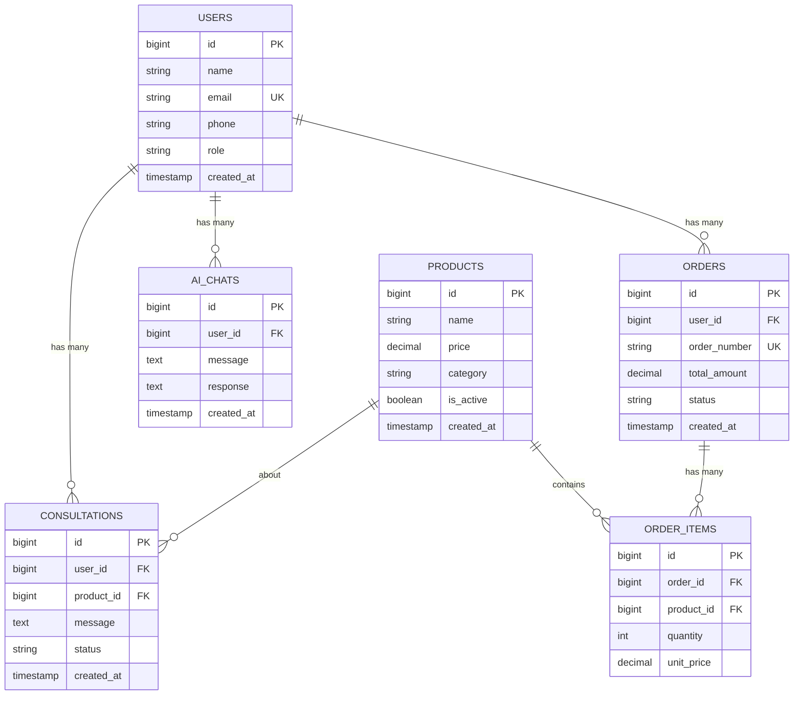

# راهنمای جامع بانک اطلاعاتی
## دستیار هوشمند یک دو سه

---

## 📋 فهرست مطالب

1. [معرفی](#معرفی)
2. [معماری دیتابیس](#معماری-دیتابیس)
3. [Schema Design](#schema-design)
4. [Data Models](#data-models)
5. [Relationships](#relationships)
6. [Indexing Strategy](#indexing-strategy)
7. [Migration Guide](#migration-guide)
8. [Backup & Recovery](#backup--recovery)
9. [Performance Optimization](#performance-optimization)
10. [Security](#security)
11. [سیستم تاریخچه MySQL](#سیستم-تاریخچه-mysql) **جدید**
12. [دستورات ساده MySQL](#دستورات-ساده-mysql) **جدید**

---

## 🎯 معرفی

سیستم دستیار هوشمند یک دو سه از دو لایه دیتابیس استفاده می‌کند:

### **SQLite (محلی)**
- **استفاده:** ذخیره موقت، cache، و حالت آفلاین
- **مکان:** دستگاه کاربر
- **مزایا:** سرعت بالا، عدم وابستگی به اینترنت

### **MySQL (سرور)**
- **استفاده:** ذخیره اصلی، همگام‌سازی، backup
- **مکان:** سرور مرکزی
- **مزایا:** قابلیت اطمینان، مقیاس‌پذیری، امنیت

---

## 🏗️ معماری دیتابیس

### **Architecture Overview**
```
┌─────────────────────┐    ┌─────────────────────┐
│   Flutter Client    │    │   Flutter Client    │
│                     │    │                     │
│  ┌───────────────┐  │    │  ┌───────────────┐  │
│  │  SQLite (Local) │  │    │  │  SQLite (Local) │  │
│  └───────────────┘  │    │  └───────────────┘  │
└─────────────────────┘    └─────────────────────┘
          │                          │
          └──────────┬─────────────────┘
                     │
           ┌─────────▼─────────┐
           │   API Server      │
           │                   │
           │ ┌───────────────┐ │
           │ │ MySQL (Central)│ │
           │ └───────────────┘ │
           └───────────────────┘
```

### **Data Flow**
1. **CREATE:** Local SQLite → API → MySQL
2. **READ:** MySQL → API → Local Cache
3. **UPDATE:** Local SQLite → API → MySQL → Sync
4. **DELETE:** Soft delete in MySQL, Remove from Local

---

## 📊 Schema Design

### **Database Structure**

#### **SQLite Schema (Local)**
```sql
-- کاربران
CREATE TABLE users (
    id INTEGER PRIMARY KEY AUTOINCREMENT,
    name TEXT NOT NULL,
    email TEXT UNIQUE NOT NULL,
    phone TEXT,
    password TEXT NOT NULL,
    role TEXT DEFAULT 'customer',
    is_synced INTEGER DEFAULT 0,
    created_at TEXT DEFAULT CURRENT_TIMESTAMP,
    updated_at TEXT DEFAULT CURRENT_TIMESTAMP,
    synced_at TEXT
);

-- محصولات
CREATE TABLE products (
    id INTEGER PRIMARY KEY AUTOINCREMENT,
    server_id INTEGER,
    name TEXT NOT NULL,
    description TEXT,
    price REAL NOT NULL,
    category TEXT,
    image_url TEXT,
    is_active INTEGER DEFAULT 1,
    is_synced INTEGER DEFAULT 0,
    created_at TEXT DEFAULT CURRENT_TIMESTAMP,
    updated_at TEXT DEFAULT CURRENT_TIMESTAMP,
    synced_at TEXT
);

-- مشاوره‌ها
CREATE TABLE consultations (
    id INTEGER PRIMARY KEY AUTOINCREMENT,
    server_id INTEGER,
    user_id INTEGER NOT NULL,
    product_id INTEGER,
    message TEXT NOT NULL,
    ai_response TEXT,
    status TEXT DEFAULT 'pending',
    is_synced INTEGER DEFAULT 0,
    created_at TEXT DEFAULT CURRENT_TIMESTAMP,
    synced_at TEXT,
    FOREIGN KEY (user_id) REFERENCES users (id),
    FOREIGN KEY (product_id) REFERENCES products (id)
);

-- چت‌های AI
CREATE TABLE ai_chats (
    id INTEGER PRIMARY KEY AUTOINCREMENT,
    server_id INTEGER,
    user_id INTEGER NOT NULL,
    message TEXT NOT NULL,
    response TEXT,
    chat_type TEXT DEFAULT 'general',
    is_synced INTEGER DEFAULT 0,
    created_at TEXT DEFAULT CURRENT_TIMESTAMP,
    synced_at TEXT,
    FOREIGN KEY (user_id) REFERENCES users (id)
);

-- فرم‌ها
CREATE TABLE forms (
    id INTEGER PRIMARY KEY AUTOINCREMENT,
    server_id INTEGER,
    title TEXT NOT NULL,
    description TEXT,
    fields TEXT NOT NULL, -- JSON format
    is_active INTEGER DEFAULT 1,
    created_by INTEGER NOT NULL,
    is_synced INTEGER DEFAULT 0,
    created_at TEXT DEFAULT CURRENT_TIMESTAMP,
    synced_at TEXT,
    FOREIGN KEY (created_by) REFERENCES users (id)
);

-- پاسخ‌های فرم
CREATE TABLE form_submissions (
    id INTEGER PRIMARY KEY AUTOINCREMENT,
    server_id INTEGER,
    form_id INTEGER NOT NULL,
    user_id INTEGER NOT NULL,
    responses TEXT NOT NULL, -- JSON format
    is_synced INTEGER DEFAULT 0,
    submitted_at TEXT DEFAULT CURRENT_TIMESTAMP,
    synced_at TEXT,
    FOREIGN KEY (form_id) REFERENCES forms (id),
    FOREIGN KEY (user_id) REFERENCES users (id)
);

-- تماس‌ها (CRM)
CREATE TABLE crm_contacts (
    id INTEGER PRIMARY KEY AUTOINCREMENT,
    server_id INTEGER,
    name TEXT NOT NULL,
    email TEXT,
    phone TEXT,
    company TEXT,
    status TEXT DEFAULT 'lead',
    notes TEXT,
    assigned_to INTEGER,
    is_synced INTEGER DEFAULT 0,
    created_at TEXT DEFAULT CURRENT_TIMESTAMP,
    updated_at TEXT DEFAULT CURRENT_TIMESTAMP,
    synced_at TEXT,
    FOREIGN KEY (assigned_to) REFERENCES users (id)
);

-- آمارها
CREATE TABLE analytics (
    id INTEGER PRIMARY KEY AUTOINCREMENT,
    server_id INTEGER,
    event_type TEXT NOT NULL,
    user_id INTEGER,
    data TEXT, -- JSON format
    is_synced INTEGER DEFAULT 0,
    created_at TEXT DEFAULT CURRENT_TIMESTAMP,
    synced_at TEXT,
    FOREIGN KEY (user_id) REFERENCES users (id)
);

-- جدول sync برای ردیابی تغییرات
CREATE TABLE sync_log (
    id INTEGER PRIMARY KEY AUTOINCREMENT,
    table_name TEXT NOT NULL,
    record_id INTEGER NOT NULL,
    action TEXT NOT NULL, -- 'insert', 'update', 'delete'
    data TEXT, -- JSON data
    synced INTEGER DEFAULT 0,
    created_at TEXT DEFAULT CURRENT_TIMESTAMP,
    synced_at TEXT
);
```

#### **MySQL Schema (Server)**
```sql
-- کاربران
CREATE TABLE users (
    id BIGINT PRIMARY KEY AUTO_INCREMENT,
    name VARCHAR(255) NOT NULL,
    email VARCHAR(255) UNIQUE NOT NULL,
    phone VARCHAR(20),
    password VARCHAR(255) NOT NULL,
    role ENUM('admin', 'manager', 'staff', 'customer') DEFAULT 'customer',
    email_verified_at TIMESTAMP NULL,
    is_active BOOLEAN DEFAULT TRUE,
    last_login_at TIMESTAMP NULL,
    created_at TIMESTAMP DEFAULT CURRENT_TIMESTAMP,
    updated_at TIMESTAMP DEFAULT CURRENT_TIMESTAMP ON UPDATE CURRENT_TIMESTAMP,
    deleted_at TIMESTAMP NULL,
    
    INDEX idx_email (email),
    INDEX idx_role (role),
    INDEX idx_active (is_active),
    INDEX idx_created (created_at)
);

-- محصولات
CREATE TABLE products (
    id BIGINT PRIMARY KEY AUTO_INCREMENT,
    name VARCHAR(255) NOT NULL,
    slug VARCHAR(255) UNIQUE,
    description TEXT,
    price DECIMAL(10,2) NOT NULL,
    category VARCHAR(100),
    image_url VARCHAR(500),
    gallery JSON,
    specifications JSON,
    stock_quantity INT DEFAULT 0,
    min_stock_level INT DEFAULT 5,
    is_active BOOLEAN DEFAULT TRUE,
    meta_title VARCHAR(255),
    meta_description TEXT,
    created_by BIGINT,
    created_at TIMESTAMP DEFAULT CURRENT_TIMESTAMP,
    updated_at TIMESTAMP DEFAULT CURRENT_TIMESTAMP ON UPDATE CURRENT_TIMESTAMP,
    deleted_at TIMESTAMP NULL,
    
    INDEX idx_name (name),
    INDEX idx_category (category),
    INDEX idx_price (price),
    INDEX idx_active (is_active),
    INDEX idx_stock (stock_quantity),
    FOREIGN KEY (created_by) REFERENCES users(id)
);

-- مشاوره‌ها
CREATE TABLE consultations (
    id BIGINT PRIMARY KEY AUTO_INCREMENT,
    user_id BIGINT NOT NULL,
    product_id BIGINT NULL,
    message TEXT NOT NULL,
    ai_response TEXT,
    human_response TEXT,
    status ENUM('pending', 'in_progress', 'completed', 'cancelled') DEFAULT 'pending',
    priority ENUM('low', 'medium', 'high', 'urgent') DEFAULT 'medium',
    assigned_to BIGINT NULL,
    rating TINYINT NULL CHECK (rating >= 1 AND rating <= 5),
    feedback TEXT,
    created_at TIMESTAMP DEFAULT CURRENT_TIMESTAMP,
    updated_at TIMESTAMP DEFAULT CURRENT_TIMESTAMP ON UPDATE CURRENT_TIMESTAMP,
    completed_at TIMESTAMP NULL,
    
    INDEX idx_user (user_id),
    INDEX idx_product (product_id),
    INDEX idx_status (status),
    INDEX idx_assigned (assigned_to),
    INDEX idx_created (created_at),
    FOREIGN KEY (user_id) REFERENCES users(id),
    FOREIGN KEY (product_id) REFERENCES products(id),
    FOREIGN KEY (assigned_to) REFERENCES users(id)
);

-- چت‌های AI
CREATE TABLE ai_chats (
    id BIGINT PRIMARY KEY AUTO_INCREMENT,
    user_id BIGINT NOT NULL,
    session_id VARCHAR(100),
    message TEXT NOT NULL,
    response TEXT,
    chat_type ENUM('general', 'support', 'sales', 'consultation') DEFAULT 'general',
    context JSON,
    ai_model VARCHAR(50) DEFAULT 'gpt-3.5-turbo',
    confidence_score DECIMAL(3,2),
    processing_time_ms INT,
    created_at TIMESTAMP DEFAULT CURRENT_TIMESTAMP,
    
    INDEX idx_user (user_id),
    INDEX idx_session (session_id),
    INDEX idx_type (chat_type),
    INDEX idx_created (created_at),
    FOREIGN KEY (user_id) REFERENCES users(id)
);

-- فرم‌ها
CREATE TABLE forms (
    id BIGINT PRIMARY KEY AUTO_INCREMENT,
    title VARCHAR(255) NOT NULL,
    description TEXT,
    fields JSON NOT NULL,
    settings JSON,
    is_active BOOLEAN DEFAULT TRUE,
    is_public BOOLEAN DEFAULT FALSE,
    max_submissions INT NULL,
    expires_at TIMESTAMP NULL,
    created_by BIGINT NOT NULL,
    created_at TIMESTAMP DEFAULT CURRENT_TIMESTAMP,
    updated_at TIMESTAMP DEFAULT CURRENT_TIMESTAMP ON UPDATE CURRENT_TIMESTAMP,
    
    INDEX idx_title (title),
    INDEX idx_active (is_active),
    INDEX idx_public (is_public),
    INDEX idx_created_by (created_by),
    FOREIGN KEY (created_by) REFERENCES users(id)
);

-- پاسخ‌های فرم
CREATE TABLE form_submissions (
    id BIGINT PRIMARY KEY AUTO_INCREMENT,
    form_id BIGINT NOT NULL,
    user_id BIGINT NULL,
    responses JSON NOT NULL,
    ip_address VARCHAR(45),
    user_agent TEXT,
    submitted_at TIMESTAMP DEFAULT CURRENT_TIMESTAMP,
    
    INDEX idx_form (form_id),
    INDEX idx_user (user_id),
    INDEX idx_submitted (submitted_at),
    FOREIGN KEY (form_id) REFERENCES forms(id),
    FOREIGN KEY (user_id) REFERENCES users(id)
);

-- تماس‌ها (CRM)
CREATE TABLE crm_contacts (
    id BIGINT PRIMARY KEY AUTO_INCREMENT,
    name VARCHAR(255) NOT NULL,
    email VARCHAR(255),
    phone VARCHAR(20),
    company VARCHAR(255),
    position VARCHAR(100),
    status ENUM('lead', 'prospect', 'customer', 'partner', 'inactive') DEFAULT 'lead',
    source VARCHAR(100),
    notes TEXT,
    tags JSON,
    assigned_to BIGINT,
    last_contact_at TIMESTAMP NULL,
    next_follow_up TIMESTAMP NULL,
    created_at TIMESTAMP DEFAULT CURRENT_TIMESTAMP,
    updated_at TIMESTAMP DEFAULT CURRENT_TIMESTAMP ON UPDATE CURRENT_TIMESTAMP,
    
    INDEX idx_name (name),
    INDEX idx_email (email),
    INDEX idx_phone (phone),
    INDEX idx_status (status),
    INDEX idx_assigned (assigned_to),
    INDEX idx_follow_up (next_follow_up),
    FOREIGN KEY (assigned_to) REFERENCES users(id)
);

-- آمارها
CREATE TABLE analytics (
    id BIGINT PRIMARY KEY AUTO_INCREMENT,
    event_type VARCHAR(100) NOT NULL,
    user_id BIGINT NULL,
    session_id VARCHAR(100),
    ip_address VARCHAR(45),
    user_agent TEXT,
    data JSON,
    created_at TIMESTAMP DEFAULT CURRENT_TIMESTAMP,
    
    INDEX idx_event_type (event_type),
    INDEX idx_user (user_id),
    INDEX idx_session (session_id),
    INDEX idx_created (created_at),
    FOREIGN KEY (user_id) REFERENCES users(id)
);

-- سفارشات
CREATE TABLE orders (
    id BIGINT PRIMARY KEY AUTO_INCREMENT,
    user_id BIGINT NOT NULL,
    order_number VARCHAR(50) UNIQUE NOT NULL,
    status ENUM('pending', 'confirmed', 'shipped', 'delivered', 'cancelled') DEFAULT 'pending',
    total_amount DECIMAL(10,2) NOT NULL,
    tax_amount DECIMAL(10,2) DEFAULT 0,
    shipping_amount DECIMAL(10,2) DEFAULT 0,
    discount_amount DECIMAL(10,2) DEFAULT 0,
    payment_status ENUM('pending', 'paid', 'failed', 'refunded') DEFAULT 'pending',
    payment_method VARCHAR(50),
    shipping_address JSON,
    billing_address JSON,
    notes TEXT,
    created_at TIMESTAMP DEFAULT CURRENT_TIMESTAMP,
    updated_at TIMESTAMP DEFAULT CURRENT_TIMESTAMP ON UPDATE CURRENT_TIMESTAMP,
    
    INDEX idx_user (user_id),
    INDEX idx_order_number (order_number),
    INDEX idx_status (status),
    INDEX idx_payment_status (payment_status),
    INDEX idx_created (created_at),
    FOREIGN KEY (user_id) REFERENCES users(id)
);

-- آیتم‌های سفارش
CREATE TABLE order_items (
    id BIGINT PRIMARY KEY AUTO_INCREMENT,
    order_id BIGINT NOT NULL,
    product_id BIGINT NOT NULL,
    quantity INT NOT NULL,
    unit_price DECIMAL(10,2) NOT NULL,
    total_price DECIMAL(10,2) NOT NULL,
    product_snapshot JSON, -- ذخیره اطلاعات محصول در زمان سفارش
    
    INDEX idx_order (order_id),
    INDEX idx_product (product_id),
    FOREIGN KEY (order_id) REFERENCES orders(id) ON DELETE CASCADE,
    FOREIGN KEY (product_id) REFERENCES products(id)
);
```

---

## 🔗 Relationships

### **Entity Relationship Diagram**


### **Key Relationships**
1. **User → Consultations:** یک کاربر می‌تواند چندین مشاوره داشته باشد
2. **User → AI Chats:** یک کاربر می‌تواند چندین چت داشته باشد
3. **Product → Consultations:** یک محصول می‌تواند موضوع چندین مشاوره باشد
4. **User → Orders:** یک کاربر می‌تواند چندین سفارش داشته باشد
5. **Order → Order Items:** یک سفارش شامل چندین آیتم است

---

## 📇 Data Models

### **User Model**
```dart
class User {
  final int? id;
  final String name;
  final String email;
  final String? phone;
  final String password;
  final UserRole role;
  final bool isActive;
  final DateTime? emailVerifiedAt;
  final DateTime? lastLoginAt;
  final DateTime? createdAt;
  final DateTime? updatedAt;
  final DateTime? deletedAt;
}

enum UserRole { admin, manager, staff, customer }
```

### **Product Model**
```dart
class Product {
  final int? id;
  final String name;
  final String? slug;
  final String? description;
  final double price;
  final String? category;
  final String? imageUrl;
  final List<String>? gallery;
  final Map<String, dynamic>? specifications;
  final int stockQuantity;
  final int minStockLevel;
  final bool isActive;
  final String? metaTitle;
  final String? metaDescription;
  final int? createdBy;
  final DateTime? createdAt;
  final DateTime? updatedAt;
  final DateTime? deletedAt;
}
```

### **Consultation Model**
```dart
class Consultation {
  final int? id;
  final int userId;
  final int? productId;
  final String message;
  final String? aiResponse;
  final String? humanResponse;
  final ConsultationStatus status;
  final ConsultationPriority priority;
  final int? assignedTo;
  final int? rating;
  final String? feedback;
  final DateTime? createdAt;
  final DateTime? updatedAt;
  final DateTime? completedAt;
}

enum ConsultationStatus { pending, inProgress, completed, cancelled }
enum ConsultationPriority { low, medium, high, urgent }
```

---

## 🚀 Indexing Strategy

### **Primary Indexes**
```sql
-- Users table
CREATE INDEX idx_users_email ON users(email);
CREATE INDEX idx_users_role ON users(role);
CREATE INDEX idx_users_active ON users(is_active);

-- Products table
CREATE INDEX idx_products_category ON products(category);
CREATE INDEX idx_products_price ON products(price);
CREATE INDEX idx_products_active ON products(is_active);
CREATE INDEX idx_products_stock ON products(stock_quantity);

-- Consultations table
CREATE INDEX idx_consultations_user ON consultations(user_id);
CREATE INDEX idx_consultations_status ON consultations(status);
CREATE INDEX idx_consultations_created ON consultations(created_at);

-- AI Chats table
CREATE INDEX idx_ai_chats_user ON ai_chats(user_id);
CREATE INDEX idx_ai_chats_session ON ai_chats(session_id);
CREATE INDEX idx_ai_chats_created ON ai_chats(created_at);
```

### **Composite Indexes**
```sql
-- برای query های مرکب
CREATE INDEX idx_products_category_active ON products(category, is_active);
CREATE INDEX idx_consultations_user_status ON consultations(user_id, status);
CREATE INDEX idx_orders_user_status ON orders(user_id, status);
```

### **Full-Text Search**
```sql
-- برای جستجوی متنی
CREATE FULLTEXT INDEX ft_products_search ON products(name, description);
CREATE FULLTEXT INDEX ft_consultations_search ON consultations(message);
```

---

## 🔄 Migration Guide

### **Migration Structure**
```
database/
├── migrations/
│   ├── 001_create_users_table.sql
│   ├── 002_create_products_table.sql
│   ├── 003_create_consultations_table.sql
│   ├── 004_create_ai_chats_table.sql
│   ├── 005_create_orders_table.sql
│   └── 006_add_indexes.sql
└── seeds/
    ├── users_seed.sql
    ├── products_seed.sql
    └── categories_seed.sql
```

### **Migration Commands**
```bash
# اجرای migration ها
php artisan migrate

# بازگشت migration
php artisan migrate:rollback

# تازه‌سازی کامل
php artisan migrate:fresh --seed

# چک کردن وضعیت
php artisan migrate:status
```

### **Sample Migration**
```sql
-- 001_create_users_table.sql
CREATE TABLE users (
    id BIGINT PRIMARY KEY AUTO_INCREMENT,
    name VARCHAR(255) NOT NULL,
    email VARCHAR(255) UNIQUE NOT NULL,
    password VARCHAR(255) NOT NULL,
    role ENUM('admin', 'customer') DEFAULT 'customer',
    created_at TIMESTAMP DEFAULT CURRENT_TIMESTAMP,
    updated_at TIMESTAMP DEFAULT CURRENT_TIMESTAMP ON UPDATE CURRENT_TIMESTAMP
);

-- Index creation
CREATE INDEX idx_users_email ON users(email);
CREATE INDEX idx_users_role ON users(role);
```

---

## 🛡️ Backup & Recovery

### **Backup Strategy**
```bash
# Daily backup
mysqldump -u username -p smartassistant > backup_$(date +%Y%m%d).sql

# Weekly full backup with compression
mysqldump -u username -p smartassistant | gzip > weekly_backup_$(date +%Y%m%d).sql.gz

# Incremental backup using binary logs
mysqlbinlog --start-datetime="2024-01-01 00:00:00" mysql-bin.000001 > incremental.sql
```

### **Recovery Process**
```bash
# Full restoration
mysql -u username -p smartassistant < backup_20240130.sql

# Point-in-time recovery
mysql -u username -p smartassistant < full_backup.sql
mysql -u username -p smartassistant < incremental.sql
```

### **Automated Backup Script**
```bash
#!/bin/bash
# backup.sh

DB_NAME="smartassistant"
DB_USER="username"
DB_PASS="password"
BACKUP_DIR="/backups"
DATE=$(date +%Y%m%d_%H%M%S)

# Create backup
mysqldump -u $DB_USER -p$DB_PASS $DB_NAME > $BACKUP_DIR/backup_$DATE.sql

# Compress
gzip $BACKUP_DIR/backup_$DATE.sql

# Remove old backups (keep last 30 days)
find $BACKUP_DIR -name "backup_*.sql.gz" -mtime +30 -delete

echo "Backup completed: backup_$DATE.sql.gz"
```

---

## ⚡ Performance Optimization

### **Query Optimization**
```sql
-- بهینه‌سازی query های پرتکرار

-- 1. استفاده از LIMIT در pagination
SELECT * FROM products 
WHERE is_active = 1 
ORDER BY created_at DESC 
LIMIT 20 OFFSET 0;

-- 2. استفاده از JOIN به جای subquery
SELECT p.*, c.name as category_name 
FROM products p
LEFT JOIN categories c ON p.category_id = c.id
WHERE p.is_active = 1;

-- 3. استفاده از INDEX HINT
SELECT * FROM products 
USE INDEX (idx_category_active)
WHERE category = 'electronics' AND is_active = 1;
```

### **Database Configuration**
```ini
# my.cnf optimizations
[mysqld]
innodb_buffer_pool_size = 2G
innodb_log_file_size = 256M
innodb_flush_log_at_trx_commit = 2
query_cache_size = 256M
max_connections = 500
```

### **Monitoring Queries**
```sql
-- بررسی slow queries
SELECT * FROM mysql.slow_log 
WHERE start_time > DATE_SUB(NOW(), INTERVAL 1 DAY);

-- نمایش process list
SHOW PROCESSLIST;

-- آمار performance
SHOW STATUS LIKE 'Handler_read%';
SHOW STATUS LIKE 'Innodb_buffer_pool%';
```

---

## 🔐 Security

### **Database Security Checklist**
- ✅ **Strong passwords** برای تمام کاربران دیتابیس
- ✅ **Limited privileges** برای هر کاربر
- ✅ **SSL/TLS encryption** برای ارتباطات
- ✅ **Regular updates** و security patches
- ✅ **Firewall rules** محدود کردن دسترسی
- ✅ **Audit logging** فعال
- ✅ **Data encryption** برای فیلدهای حساس

### **User Privileges**
```sql
-- Admin user (full access)
CREATE USER 'admin_user'@'localhost' IDENTIFIED BY 'strong_password';
GRANT ALL PRIVILEGES ON smartassistant.* TO 'admin_user'@'localhost';

-- Application user (limited access)
CREATE USER 'app_user'@'%' IDENTIFIED BY 'app_password';
GRANT SELECT, INSERT, UPDATE ON smartassistant.* TO 'app_user'@'%';
GRANT DELETE ON smartassistant.analytics TO 'app_user'@'%';

-- Read-only user for reports
CREATE USER 'report_user'@'%' IDENTIFIED BY 'report_password';
GRANT SELECT ON smartassistant.* TO 'report_user'@'%';

FLUSH PRIVILEGES;
```

### **Data Encryption**
```sql
-- Sensitive data encryption
ALTER TABLE users 
ADD COLUMN encrypted_data VARBINARY(255);

-- Use AES encryption for sensitive fields
UPDATE users 
SET encrypted_data = AES_ENCRYPT(sensitive_info, 'encryption_key');

-- Decrypt when needed
SELECT AES_DECRYPT(encrypted_data, 'encryption_key') as decrypted_data 
FROM users;
```

---

## 📊 Monitoring & Maintenance

### **Performance Monitoring**
```sql
-- Daily health check queries
SELECT 
    table_name,
    round(((data_length + index_length) / 1024 / 1024), 2) AS 'DB Size in MB'
FROM information_schema.tables 
WHERE table_schema = 'smartassistant';

-- Connection monitoring
SHOW STATUS LIKE 'Threads_connected';
SHOW STATUS LIKE 'Max_used_connections';
```

### **Maintenance Tasks**
```sql
-- Weekly optimization
OPTIMIZE TABLE users, products, consultations, ai_chats;

-- Update table statistics
ANALYZE TABLE users, products, consultations;

-- Check table integrity
CHECK TABLE users, products, consultations;
```

### **Automated Maintenance Script**
```bash
#!/bin/bash
# maintenance.sh

mysql -u admin_user -p <<EOF
-- Optimize tables
OPTIMIZE TABLE users, products, consultations, ai_chats;

-- Update statistics
ANALYZE TABLE users, products, consultations, ai_chats;

-- Clean old data
DELETE FROM analytics WHERE created_at < DATE_SUB(NOW(), INTERVAL 6 MONTH);
DELETE FROM ai_chats WHERE created_at < DATE_SUB(NOW(), INTERVAL 3 MONTH);

-- Show table sizes
SELECT 
    table_name,
    round(((data_length + index_length) / 1024 / 1024), 2) AS 'DB Size in MB'
FROM information_schema.tables 
WHERE table_schema = 'smartassistant';
EOF
```

---

## 🧪 Testing

### **Database Testing Strategy**
1. **Unit Tests:** تست منطق models
2. **Integration Tests:** تست روابط بین جداول
3. **Performance Tests:** تست کارایی queries
4. **Data Integrity Tests:** تست صحت داده‌ها

### **Sample Test Data**
```sql
-- Test data insertion
INSERT INTO users (name, email, password, role) VALUES
('تست ادمین', 'admin@test.com', 'hashed_password', 'admin'),
('تست کاربر', 'user@test.com', 'hashed_password', 'customer');

INSERT INTO products (name, price, category, is_active) VALUES
('محصول تست ۱', 100000, 'الکترونیک', 1),
('محصول تست ۲', 200000, 'پوشاک', 1);
```

---

## 📋 سیستم تاریخچه MySQL

### **🎯 هدف**

سیستم تاریخچه بروزرسانی MySQL برای ردیابی تمام تغییرات پروژه طراحی شده است.

### **🗄️ جدول update_history**

```sql
CREATE TABLE update_history (
    id INT AUTO_INCREMENT PRIMARY KEY,
    title VARCHAR(255) NOT NULL,
    version VARCHAR(50) NOT NULL,
    shamsi_date VARCHAR(20) NOT NULL,
    shamsi_time VARCHAR(10) NOT NULL,
    created_at TIMESTAMP DEFAULT CURRENT_TIMESTAMP,
    user_problem TEXT NOT NULL,
    solution_description TEXT NOT NULL,
    user_comment TEXT,
    tags TEXT,
    priority ENUM('low', 'medium', 'high', 'critical') DEFAULT 'medium',
    category ENUM('feature', 'bugfix', 'enhancement', 'security', 'testing') DEFAULT 'feature',
    status ENUM('completed', 'in_progress', 'planned') DEFAULT 'completed'
);
```

### **🏷️ دسته‌بندی‌های استاندارد**

| **Category** | **توضیح** | **مثال** |
|-------------|----------|---------|
| `feature` | ویژگی جدید | اضافه کردن سیستم پیامک |
| `bugfix` | رفع باگ | رفع مشکل اتصال دیتابیس |
| `enhancement` | بهبود موجود | بهینه‌سازی UI |
| `security` | امنیت | بروزرسانی احراز هویت |
| `testing` | تست | اضافه کردن unit tests |

| **Priority** | **توضیح** | **زمان اجرا** |
|-------------|----------|-------------|
| `low` | کم‌اهمیت | هفته‌ها |
| `medium` | متوسط | روزها |
| `high` | مهم | ساعت‌ها |
| `critical` | بحرانی | فوری |

---

## 💻 دستورات ساده MySQL

### **🔍 مشاهده تاریخچه**

```bash
# آخرین 5 بروزرسانی
mysql -u root ai_123 -e "
SELECT id, title, version, shamsi_date, category, priority
FROM update_history
ORDER BY id DESC
LIMIT 5;"

# آمار کلی
mysql -u root ai_123 -e "
SELECT category, COUNT(*) as count
FROM update_history
GROUP BY category
ORDER BY count DESC;"

# جستجو در عناوین
mysql -u root ai_123 -e "
SELECT title, shamsi_date, category
FROM update_history
WHERE title LIKE '%پیامک%'
ORDER BY id DESC;"
```

### **➕ ثبت بروزرسانی جدید**

```bash
# ثبت ویژگی جدید
mysql -u root ai_123 -e "
INSERT INTO update_history (
    title, version, shamsi_date, shamsi_time,
    user_problem, solution_description, tags,
    priority, category, status
) VALUES (
    'اضافه کردن ویژگی جدید',
    '1.2.0',
    '۱۴۰۴/۰۶/۰۱',
    '$(date +%H:%M)',
    'شرح نیاز کاربر',
    'شرح راه‌حل پیاده‌سازی شده',
    'feature, new, enhancement',
    'medium',
    'feature',
    'completed'
);"

# ثبت رفع باگ
mysql -u root ai_123 -e "
INSERT INTO update_history (
    title, version, shamsi_date, shamsi_time,
    user_problem, solution_description, tags,
    priority, category, status
) VALUES (
    'رفع مشکل [شرح مشکل]',
    '1.2.1',
    '۱۴۰۴/۰۶/۰۱',
    '$(date +%H:%M)',
    'گزارش باگ: [توضیح]',
    'راه‌حل: [شرح رفع مشکل]',
    'bugfix, fix, urgent',
    'high',
    'bugfix',
    'completed'
);"
```

### **🔧 مدیریت دیتابیس**

```bash
# بررسی وضعیت دیتابیس
mysql -u root -e "SHOW DATABASES LIKE 'ai_123';"

# بررسی جداول
mysql -u root ai_123 -e "SHOW TABLES;"

# بررسی ساختار جدول
mysql -u root ai_123 -e "DESCRIBE update_history;"

# تعداد کل رکوردها
mysql -u root ai_123 -e "SELECT COUNT(*) as total_updates FROM update_history;"

# پاک کردن دیتابیس (احتیاط!)
# mysql -u root -e "DROP DATABASE ai_123;"
```

### **📊 گزارش‌گیری پیشرفته**

```bash
# گزارش ماهانه
mysql -u root ai_123 -e "
SELECT 
    LEFT(shamsi_date, 7) as month,
    category,
    COUNT(*) as count
FROM update_history
GROUP BY month, category
ORDER BY month DESC, count DESC;"

# گزارش اولویت‌ها
mysql -u root ai_123 -e "
SELECT priority, COUNT(*) as count, 
       ROUND(COUNT(*) * 100.0 / (SELECT COUNT(*) FROM update_history), 2) as percentage
FROM update_history
GROUP BY priority
ORDER BY count DESC;"
```

---

**نسخه:** 1.2.0  
**آخرین به‌روزرسانی:** ۱ شهریور ۱۴۰۴  
**نگهداری:** تیم توسعه دستیار هوشمند یک دو سه
